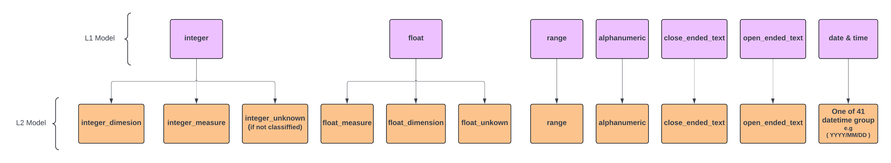
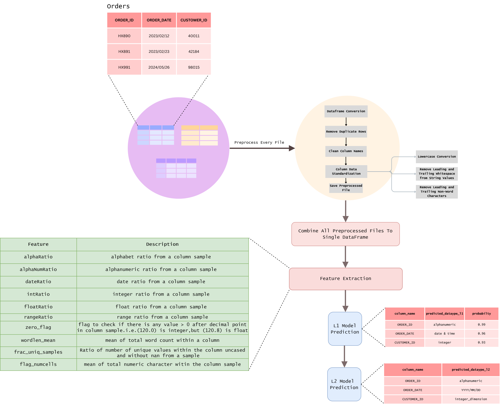
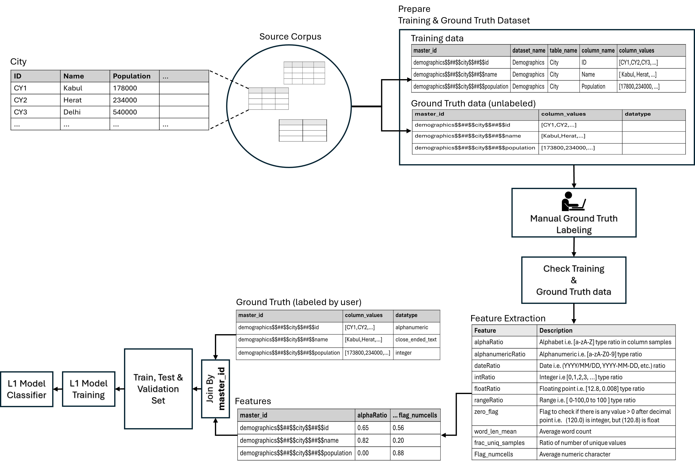
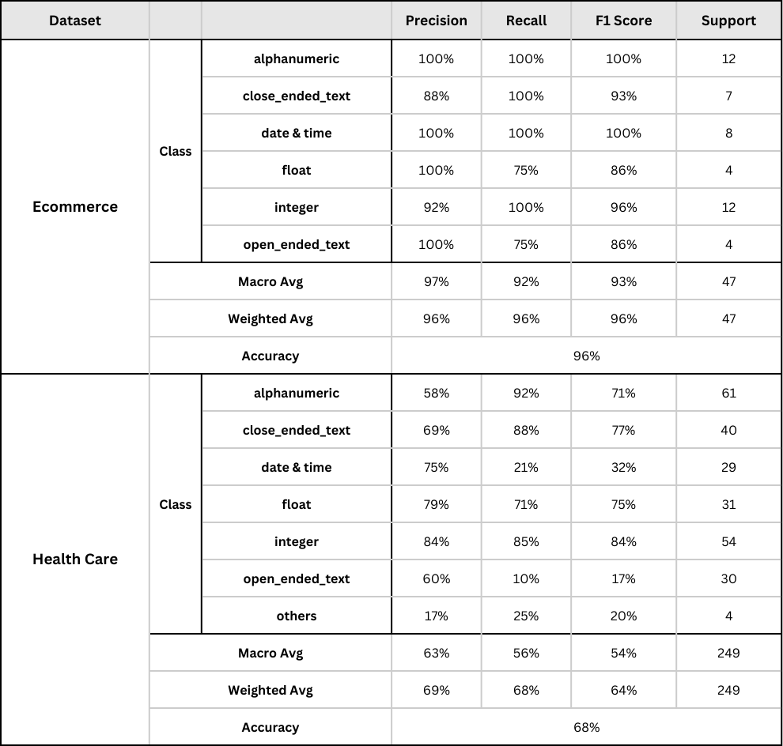
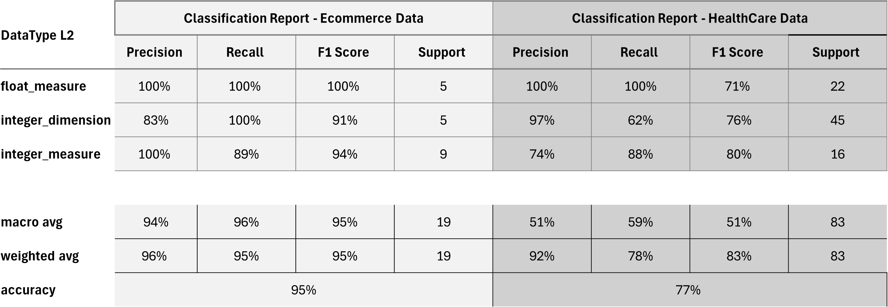

<p align="center">
      
 <h3 align="center"><i>Empowering Business Users With Self Serve Analytics</i></h3> 

## What is it ?
This is a cutting-edge project leveraging advanced Machine Learning technologies to accurately discern and classify data types from various values. Designed to enhance data preprocessing and analysis pipelines, this tool automates the often tedious and error-prone task of manually identifying data types.

## Table of contents
- [Getting Started](#getting-started)
- [Main Features](#main-features)
- [Where to get it](#where-to-get-it)
- [Performance](#performance)
- [License](#license)
- [Contributing](#contributing)

##  Getting Started
To quickly start using the library just [install](#where-to-get-it) and follow jupyter notebook below ( or directly hop on the collab notebook ).
### Inference - DataType Identification
- [Google Collab Notebook](https://colab.research.google.com/drive/137XKjKA-awa5XYlb1bAnOoFCl3XALh1K?usp=sharing) 
- [Jupyter Notebook](DataTypeIdentification-Inference.ipynb)  
### Training - L1 Model
- [Google Collab Notebook]()
- [Jupyter Notebook](DataTypeIdentification-Training.ipynb)

> [!IMPORTANT]  
> **openai api key** is required for running L2 model inference.

## Main Features
#### Categorization - L1 & L2 Datatype


- Has two models, **L1 model** (_**uses Classifier**_) that identifies normal datatypes  ( **integer, float, alphanumeric, range_type, date & time, open_ended_text, close_ended_text**)
-  **L2 model**  further classifies L1 datatype result that are **integer** or **float** to measure,dimension or unknown (if not classified) (_**uses LLM**_) and date & time into one of **41** date-time formats like (YYYY-MM-DDTHH:MM:SS, YYYY/MM/DD, MM-DD-YYYY HH:MM AM/PM ) (_**uses RegEx**_).
#### Inference Workflow - Datatype Identification 


#### Training Workflow - L1 Model 


>  [!IMPORTANT]  
> In the figure above **master_id** = dataset_name$$##$$table_name$$##$$column_name   
> that is used to uniquely identify the row and very important when joining labels & training dataset. 


## Where to get it?
Binary installers for the latest released version are available at the [Python Package Index (PyPI)](https://pypi.org/project/legoai/) & also at [GitHub](https://github.com/LEGOAI-TECHNOLOGIES/legoai_community_accelerator)
```
# PyPI
> pip install legoai
```
```
# GitHub
> pip install git+https://github.com/LEGOAI-TECHNOLOGIES/legoai_community_accelerator
```
## Performance
> [!NOTE]  
> **Source Ecommerce:** https://www.kaggle.com/datasets/olistbr/brazilian-ecommerce  
>  ```Total Tables: 9``` , ```Total Columns: 52```   
> **Source Healthcare:** https://mitre.box.com/shared/static/aw9po06ypfb9hrau4jamtvtz0e5ziucz.zip  
> ```Total Tables: 18```, ```Total Columns: 249``` 

#### Classification Report - L1 Model
    
  
#### Classification Report - L2 Model
   
  
#### Execution Chart - Google Collab Environment


## License
The project is released under the [MIT License](LICENSE)

## Contributing
Any contributions to this project is **welcomed**, you can follow the steps below for contribution:
1. Fork the repository.
2. Create a new feature branch feature/*. (```git checkout -b feature/AmazingFeature```)
3. Make & add your changes.
4. Commit your changes. (```git commit -m 'Added some Amazing feature'```)
5. Push to the branch. (```git push origin feature/AmazingFeature```)
6. Create a new [Pull Request](https://github.com/LEGOAI-TECHNOLOGIES/legoai_community_accelerator/pulls).

